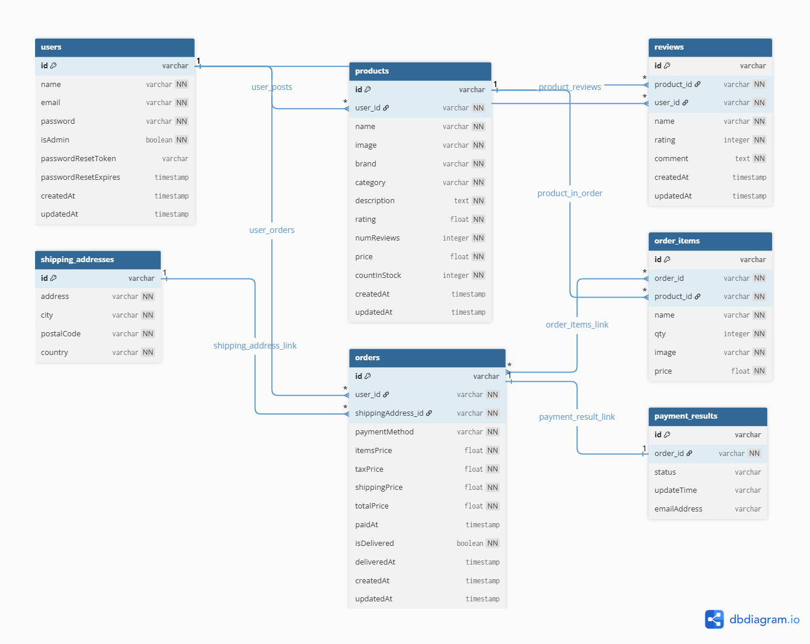

# E-Com MERN

This is a full-stack e-commerce platform built with the MERN stack (MongoDB, Express.js, React, Node.js).
It provides a robust foundation for an online store, featuring user and product management, and secure authentication.

## Description

This project is a complete e-commerce solution, built with a focus on clean architecture and scalable features.
The backend is structured using the MVC (Model-View-Controller) pattern with Node.js and Express.js. The frontend is a dynamic single-page application built with React and styled using Tailwind CSS, with Redux for state management.
Key features include robust authentication, a secure password reset mechanism, and support for both user and administrator roles. All persistent data is managed in a MongoDB database.

## DataBase design



## Environment Variables

```
PORT = 5000
NODE_ENV = development
MONGODB_URI = "your_mongo_db_URL"


JWT_SECRET = your_jwt_secret_token
SESSION_SECRET = your_session_token
CLIENT_URL = http://localhost:3000

GOOGLE_CLIENT_ID = your_google_client_id
GOOGLE_CLIENT_SECRET = your_google_client_secret


STRIPE_SECRET_KEY = your-stripe-secret-key
PAGINATION_LIMIT = 8

EMAIL_HOST = sandbox.smtp.mailtrap.io
EMAIL_PORT = your_port_num
EMAIL_USERNAME = your_nodemailer_email_username
EMAIL_PASSWORD = your_nodemailer_email_password
```

## Installing and Running

```
git clone https://github.com/PraveenUppar/MERN-E-Com.git
```

```
cd backend
```

```
npm install
npm run dev
```

```
cd frontend
```

```
npm install
npm run dev
```
