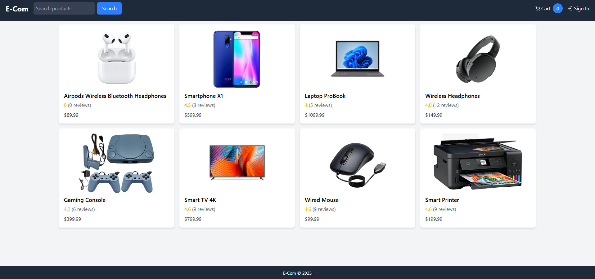
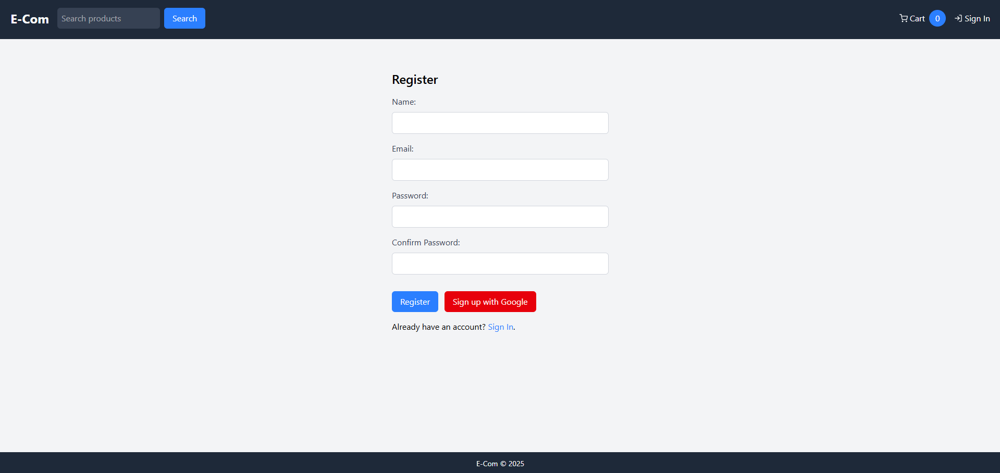
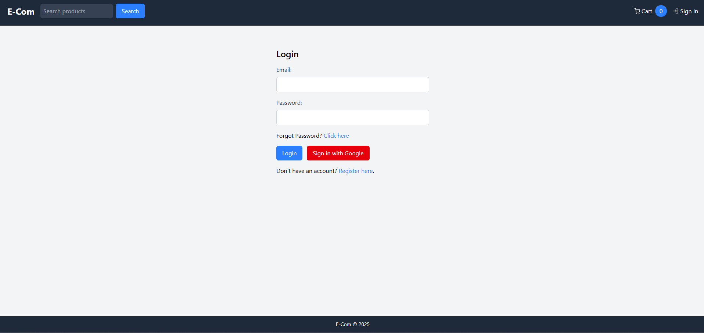
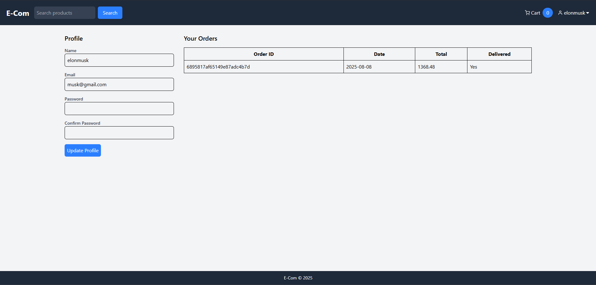
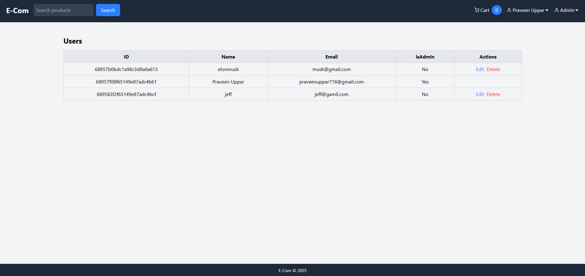
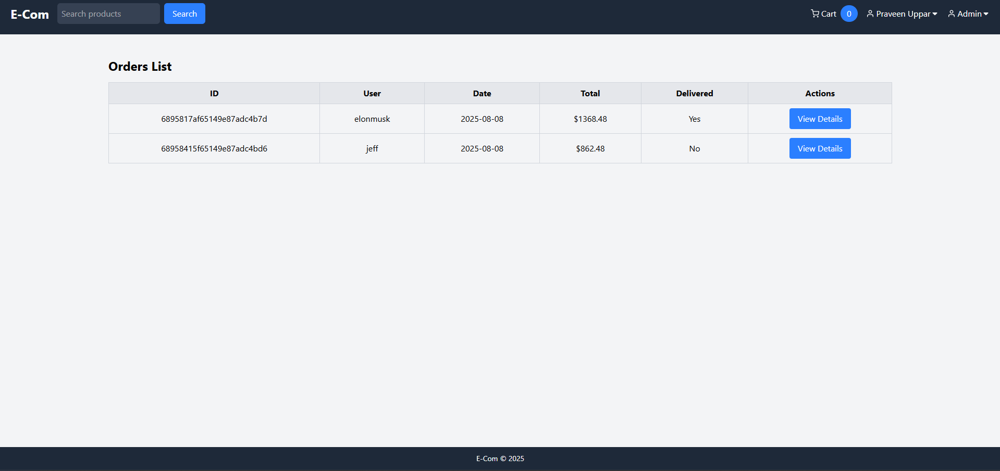
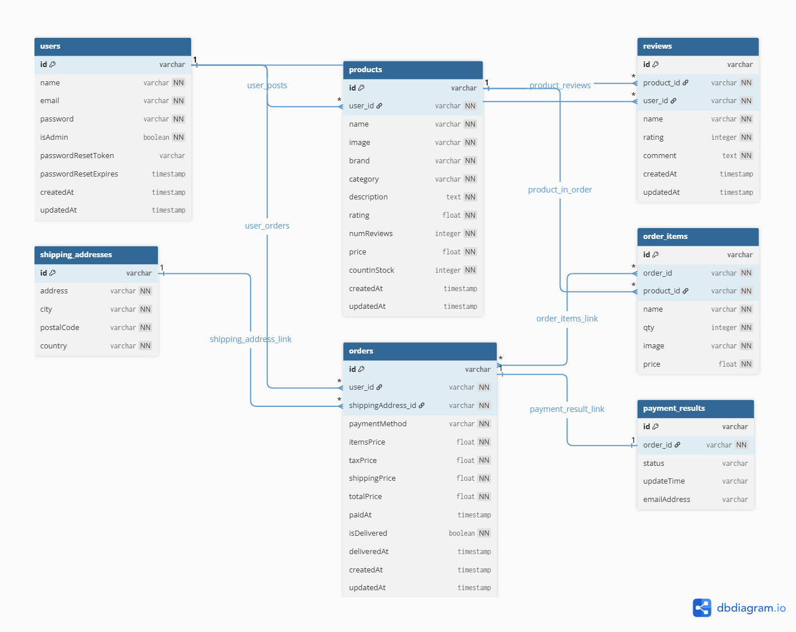

# E-Com MERN

This is a full-stack e-commerce platform built with the MERN stack (MongoDB, Express.js, React, Node.js). 
It provides a robust foundation for an online store, featuring user and product management, and secure authentication.

## Table of Content
1. [Description](#description)
2. [Features](#features)
3. [Screenshots](#screenshots)
4. [Database design](#database-design)
5. [Environment Variables](#environment-variables)
6. [Installing and Running](#installing-and-running)

## Description

This project is a complete e-commerce solution, built with a focus on clean architecture and scalable features. 
The backend is structured using the MVC (Model-View-Controller) pattern with Node.js and Express.js. The frontend is a dynamic single-page application built with React and styled using Tailwind CSS, with Redux for state management. 
Key features include robust authentication, a secure password reset mechanism, and support for both user and administrator roles. All persistent data is managed in a MongoDB database.

## Features
-   **User Authentication**: Secure user registration, login, and password reset.
-   **Role-Based Access Control**: Separate permissions for regular users and administrators.
-   **Product Management**: Admin panel to add, edit, and delete products.
-   **Shopping Cart**: Functionality to add items to a cart before checkout.
-   **Stripe Integration**: Secure payment processing for orders.
-   **Order Tracking**: Users can view their order history and status.
-   **Responsive Design**: A user-friendly interface that works on all devices.

## Screenshots

#### _<div align="left"><sub></sub></div>_

|                    Homepage                     |                      Registerpage                       |                    Loginpage                     |
| :---------------------------------------------: | :------------------------------------------------------: | :----------------------------------------------: |
|  |  |  |

|                   Orderpage                    |                    Adminpage                    |                  Deliverypage                   |
| :------------------------------------------: | :----------------------------------------: | :--------------------------------------: |
|  |  |  |


## DataBase design
<p >
  
</p>

## Environment Variables

```
PORT = 5000
NODE_ENV = development
MONGODB_URI = "your_mongo_db_URL"


JWT_SECRET = your_jwt_secret_token
SESSION_SECRET = your_session_token
CLIENT_URL = http://localhost:3000

GOOGLE_CLIENT_ID = your_google_client_id
GOOGLE_CLIENT_SECRET = your_google_client_secret


STRIPE_SECRET_KEY = your-stripe-secret-key
PAGINATION_LIMIT = 8

EMAIL_HOST = sandbox.smtp.mailtrap.io
EMAIL_PORT = your_port_num
EMAIL_USERNAME = your_nodemailer_email_username
EMAIL_PASSWORD = your_nodemailer_email_password
```

## Installing and Running

```
git clone https://github.com/PraveenUppar/MERN-E-Com.git
```
```
cd server
```
```
npm install
npm run dev
```
```
cd client
```
```
npm install
npm run dev
```

